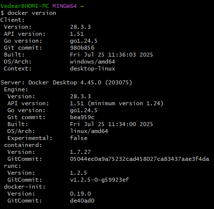
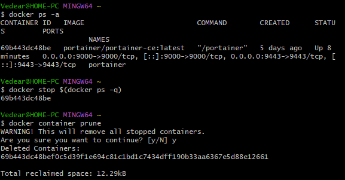
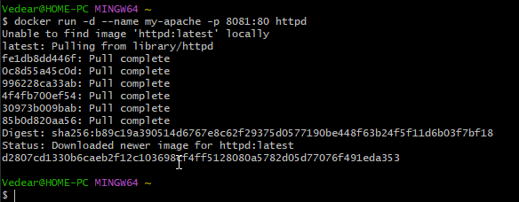
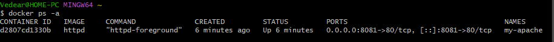
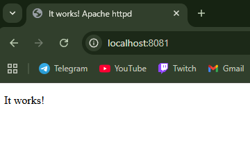

# Начало работы с Apache

## Проверка Docker'а

```bash
docker version
```


## Удаление старых контейнеров

```bash
docker ps -a

docker stop $(docker ps -q)

docker container prune
```



## Поиск, установка и запуск Apache с Debian

```bash
docker run -d --name my-apache -p 8081:80 httpd
```




## Проверка в браузере

```
localhost:8081
```

