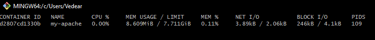
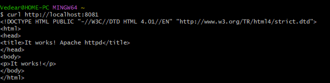
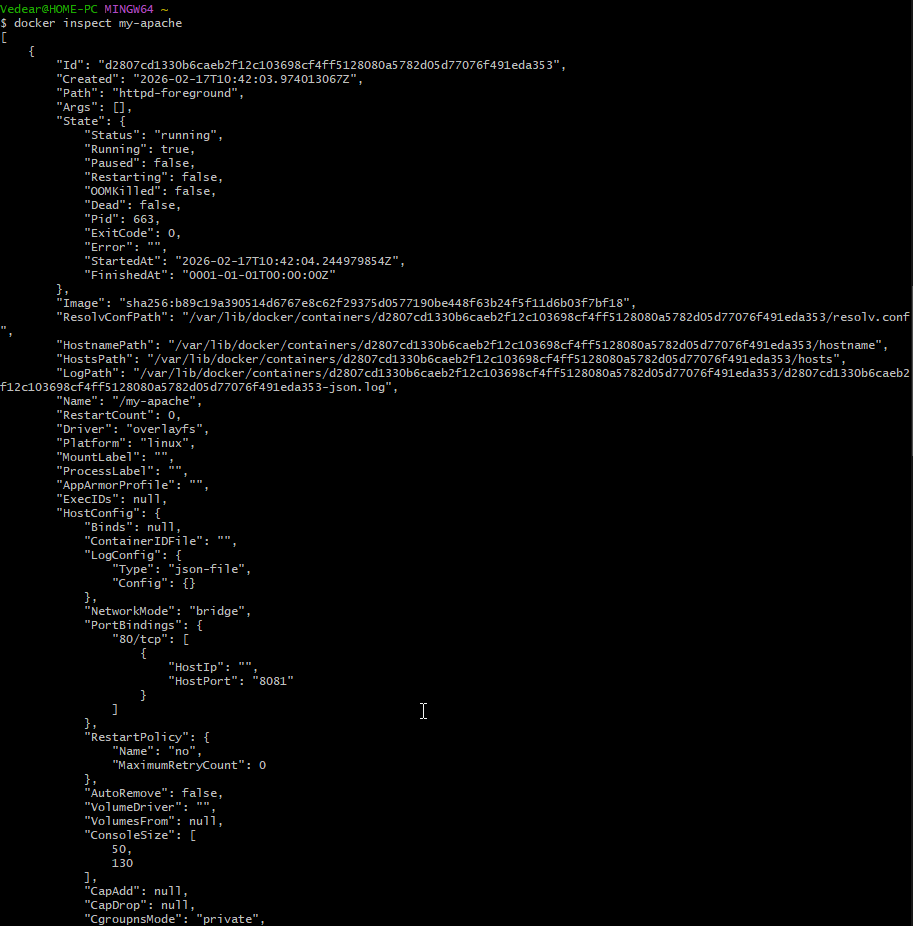
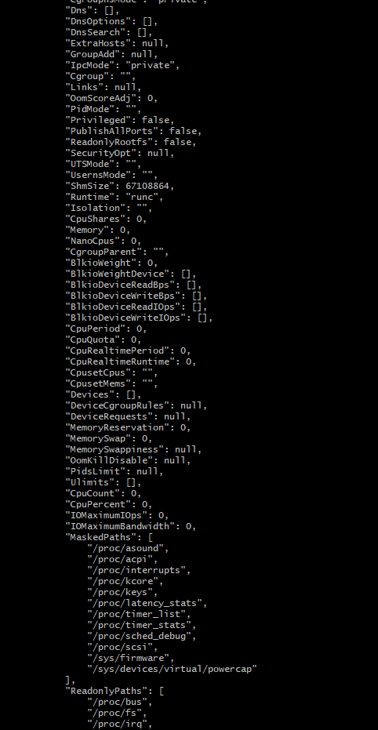
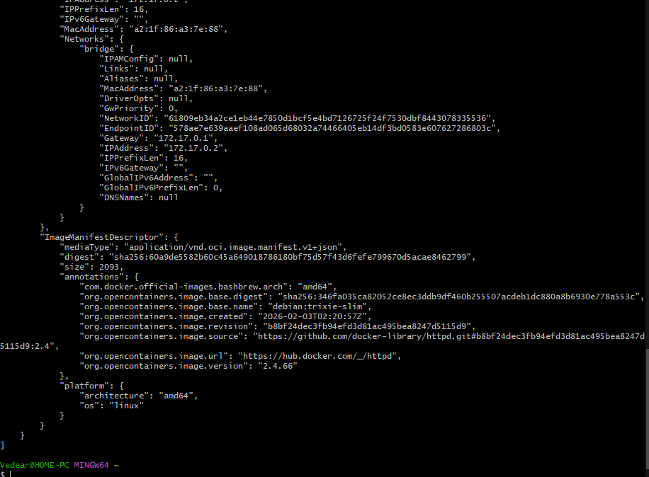
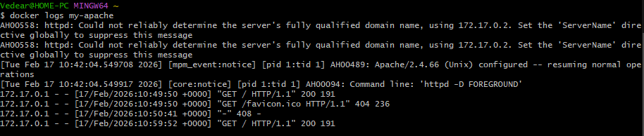
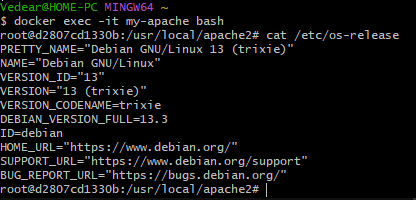
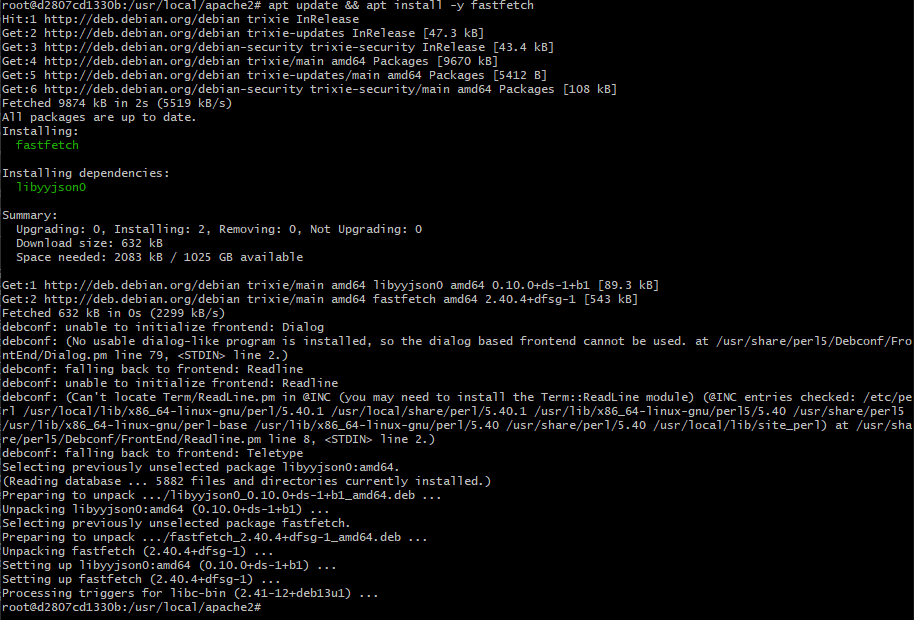
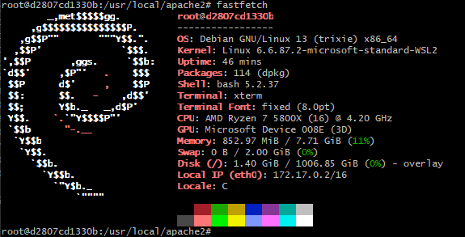

# Начало работы с Apache

## Проверка Docker'а

```bash
docker version
```


## Удаление старых контейнеров

```bash
docker ps -a

docker stop $(docker ps -q)

docker container prune
```


## Поиск, установка и запуск Apache с Debian

```bash
docker run -d --name my-apache -p 8081:80 httpd
```


## Проверка в браузере

```
localhost:8081
```


## Проверки Docker и Apache

```bash
docker stats
```


```bash
curl http://localhost:8081
```


```bash
docker inspect my-apache
```





```bash
docker logs my-apache
```


```bash
docker exec -it my-apache bash

cat /etc/os-release
```


```bash
apt update && apt install -y fastfetch
```


```bash
fastfetch
```
