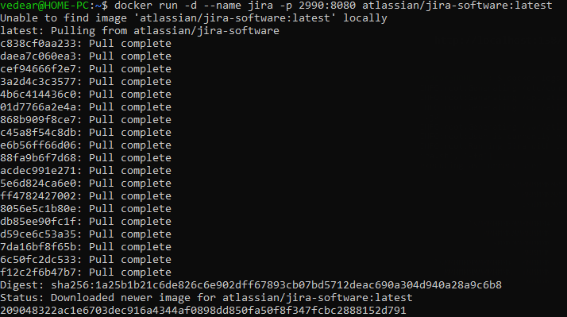
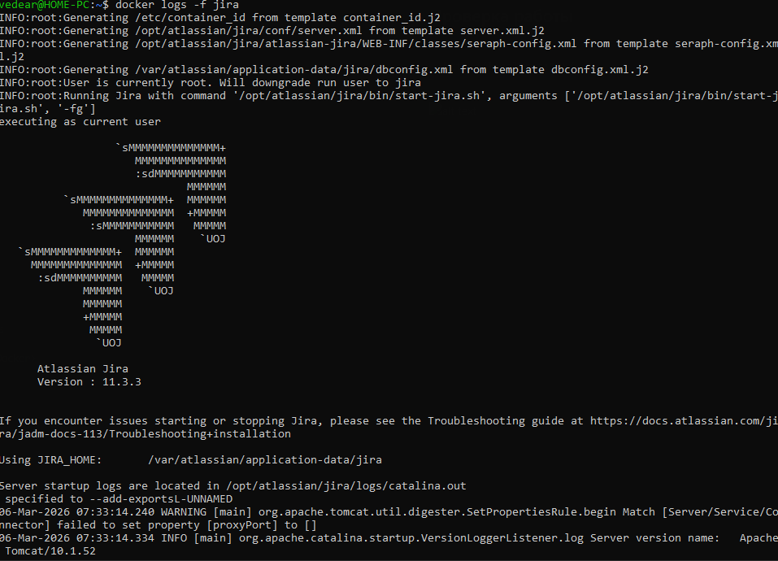
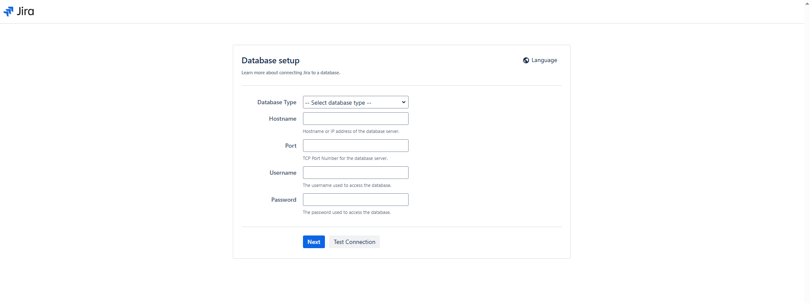

# Пример работы Jira

## Установка Jira

```
docker run -d --name jira -p 2990:8080 atlassian/jira-software:latest
```


## Проверка логов установки

```
http://localhost:158/
```


## Проверка работы

```
http://localhost:2990/
```
