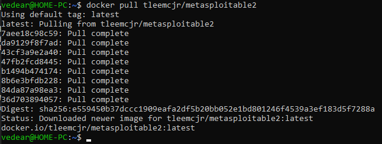
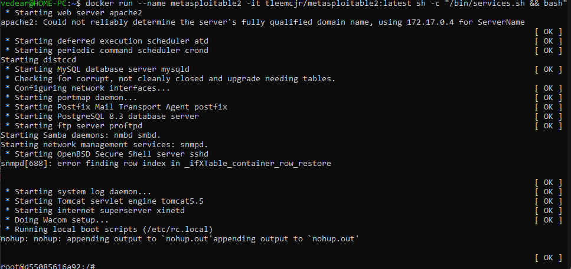

# Пример работы Metasploitable2

## Установка Metasploitable2

```
docker pull tleemcjr/metasploitable2
```


## Проверка работы

```
docker run --name metasploitable2 -it tleemcjr/metasploitable2:latest sh -c "/bin/services.sh && bash"
```


## Выход

```
exit
```

## Удаление

```
docker rmi tleemcjr/metasploitable2
```