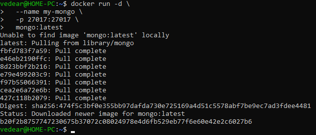
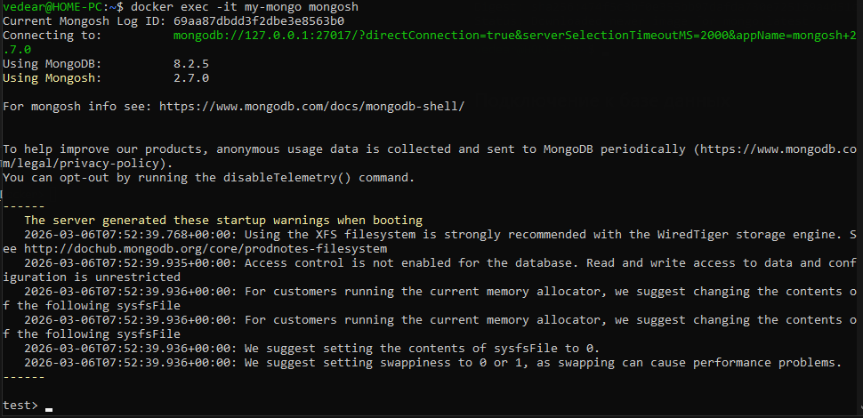
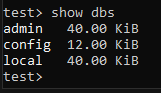

# Пример работы MySQL

## Установка MySQL

```
docker run -d \
  --name my-mongo \
  -p 27017:27017 \
  mongo:latest
```


## Подключение к базе данных

```
docker exec -it my-mongo mongosh
```


## Проверка работы

```
show dbs
```


## Выход

```
exit
```