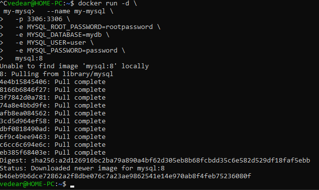
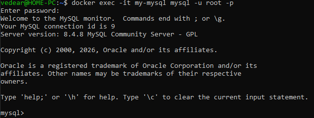
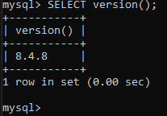

# Пример работы MySQL

## Установка MySQL

```
docker run -d \
  --name my-mysql \
  -p 3306:3306 \
  -e MYSQL_ROOT_PASSWORD=rootpassword \
  -e MYSQL_DATABASE=mydb \
  -e MYSQL_USER=user \
  -e MYSQL_PASSWORD=password \
  mysql:8
```


## Подключение к базе данных

```
docker exec -it my-mysql mysql -u root -p
```


## Проверка работы

```
SELECT version();
```


## Выход

```
exit
```