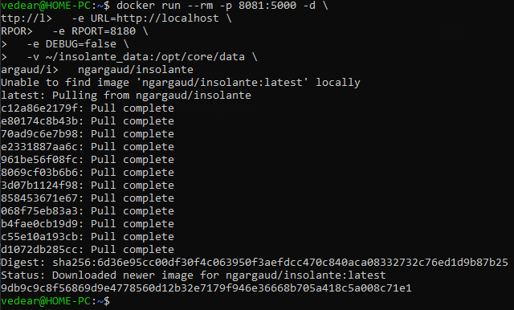
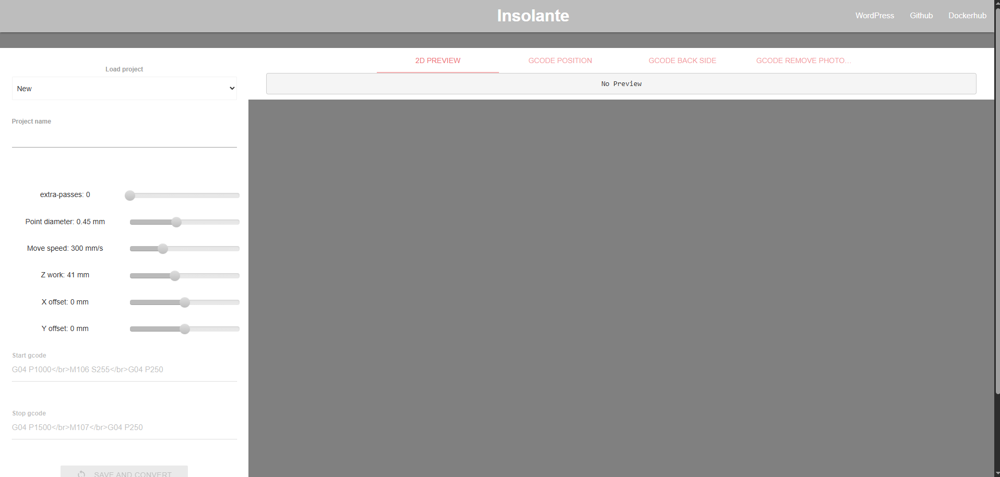

# Пример работы Pcb2gcode

## Установка Pcb2gcode

```
docker run --rm -p 8081:5000 -d \
  -e URL=http://localhost \
  -e RPORT=8180 \
  -e DEBUG=false \
  -v ~/insolante_data:/opt/core/data \
  ngargaud/insolante
```


## Проверка работы

```
http://localhost:8081/
```
