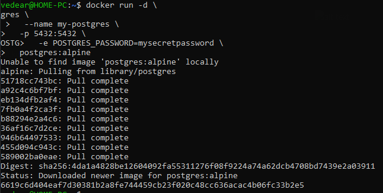
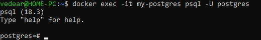
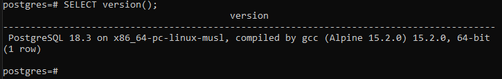

# Пример работы MySQL

## Установка MySQL

```
docker run -d \
  --name my-postgres \
  -p 5432:5432 \
  -e POSTGRES_PASSWORD=mysecretpassword \
  postgres:alpine
```


## Подключение к базе данных

```
docker exec -it my-postgres psql -U postgres
```


## Проверка работы

```
SELECT version();
```


## Выход

```
exit
```