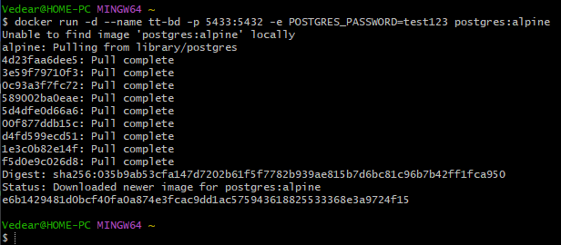
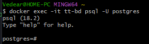
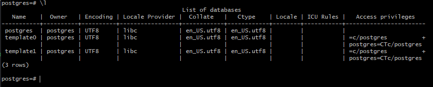
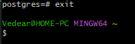
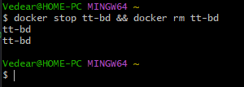

# Работа с Postgres

Установка и запуск контейнера

```bash
docker run -d --name tt-bd -p 5433:5432 -e POSTGRES_PASSWORD=test123 postgres:alpine
```


Вход в базу данных контейнера

```bash
docker exec -it tt-bd psql -U postgres
```


Получение списка Баз данных

```bash
\l
```


Выход с контейнера баз данных

```bash
exit
```


Остановка и удаление контейнера

```bash
docker stop tt-bd && docker rm tt-bd
```
