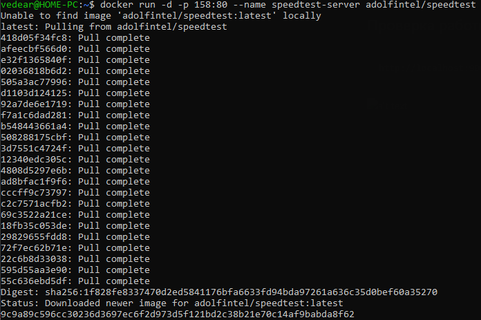
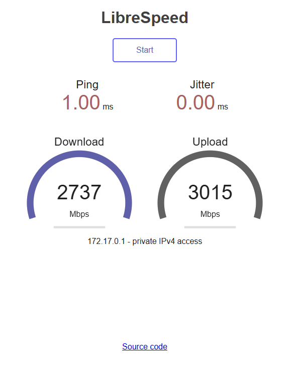

# Пример работы Speedtest

## Установка Speedtest

```
docker run -d -p 158:80 --name speedtest-server adolfintel/speedtest
```


## Проверка работы

```
http://localhost:158/
```


Данный локально показывают скорость работы диска