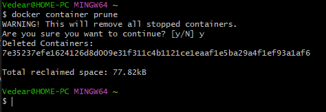
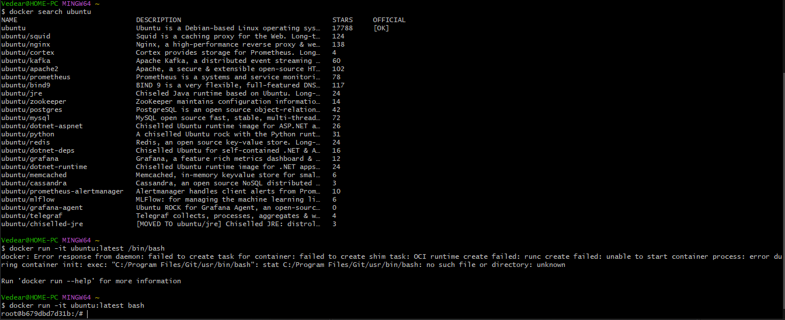
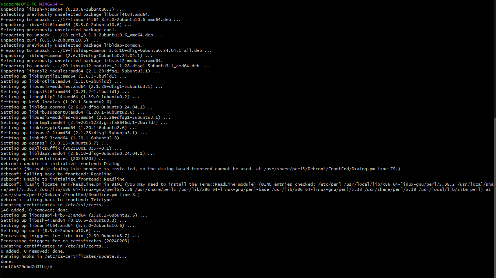
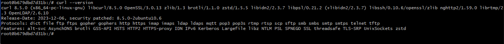
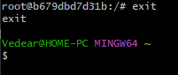

# Работа с Ubuntu в Docker

Удаление контейнеров

```bash
docker container prune
```


docker run -it --rm ubuntu:latest /bin/bash

Установка и запуск контейнера

```bash
docker run -it ubuntu:latest bash
```



Установка и проверка "curl"

```bash
apt update && apt install curl -y

curl --version
```




Выход из контейнера

```bash
exit
```
