# Начало работы с cAdvisor

## Проверка Docker'а

```bash
docker version
```
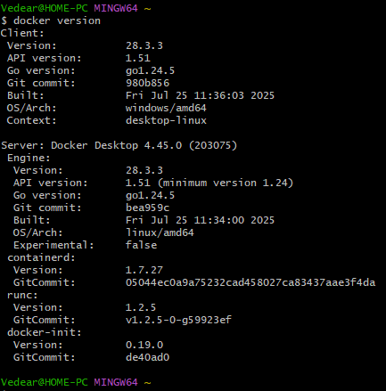

## Удаление старых контейнеров

```bash
docker ps -a

docker container prune
```

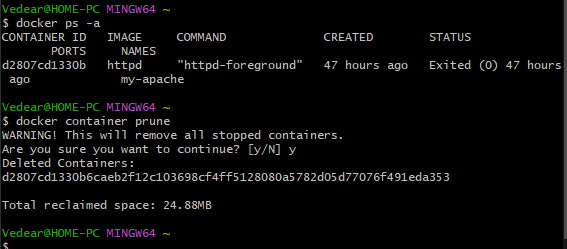

## Поиск, установка и запуск cAdvisor

```bash
docker run -d --name cadvisor -p 8083:8080 --restart always gcr.io/cadvisor/cadvisor:latest

docker ps -a
```

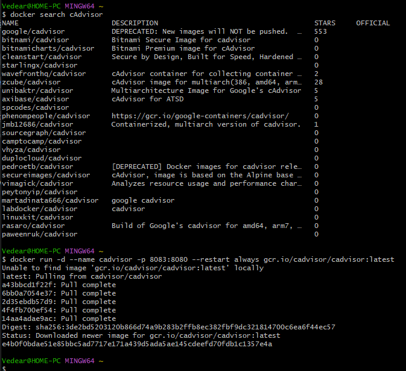
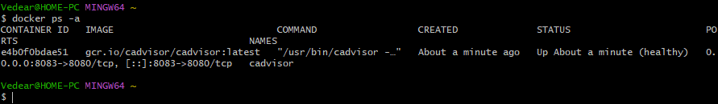

## Проверка в браузере

```
localhost:8083
```

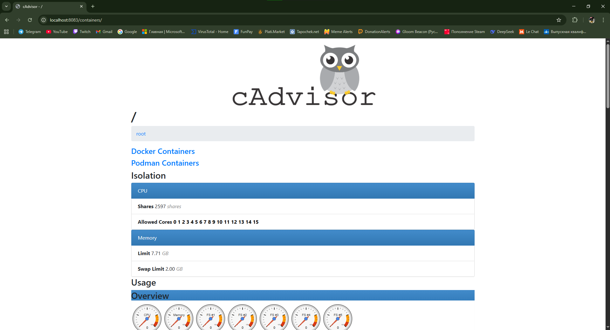

## Проверки Docker и cAdvisor

```bash
docker stats
```
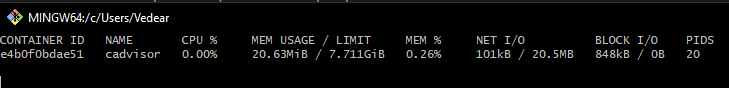

```bash
curl http://localhost:8083
```
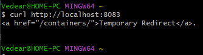

```bash
docker inspect cadvisor
```
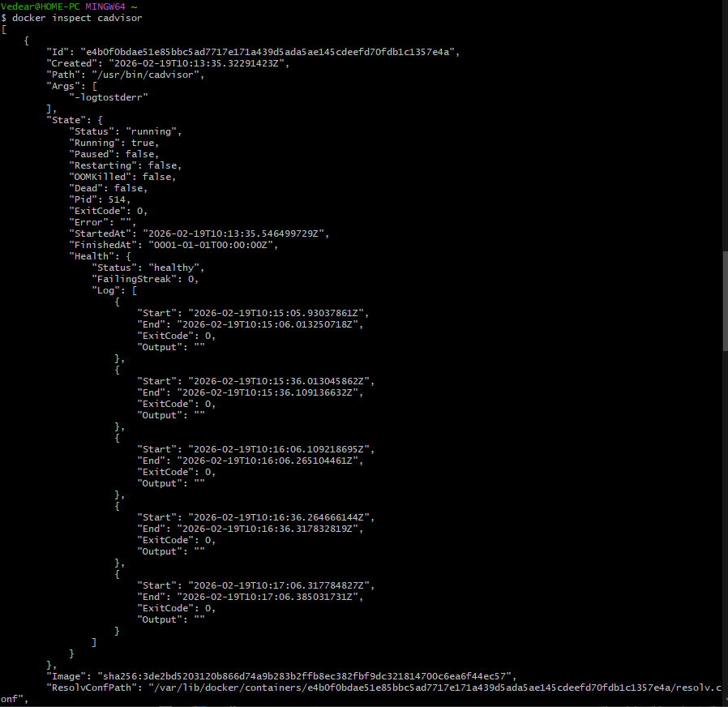
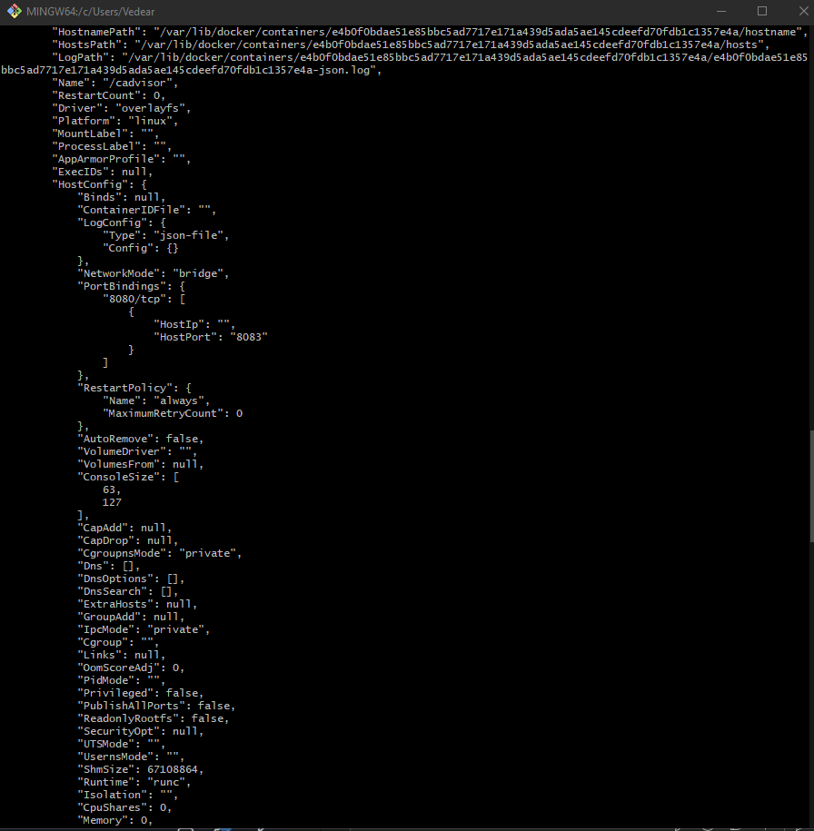
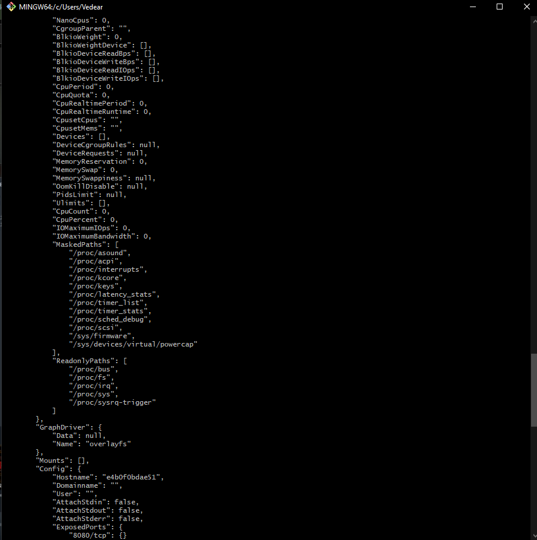
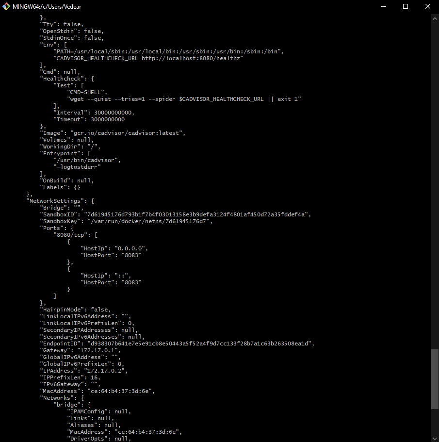

```bash
docker logs cadvisor
```
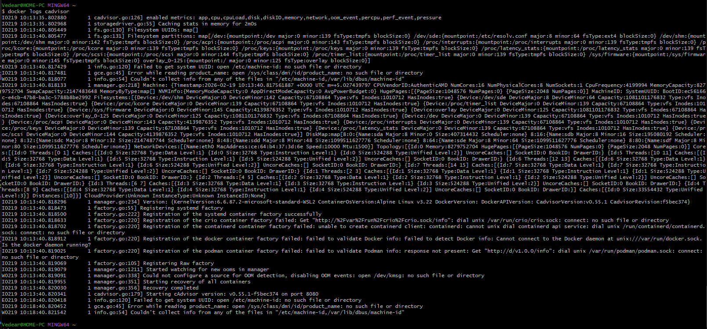